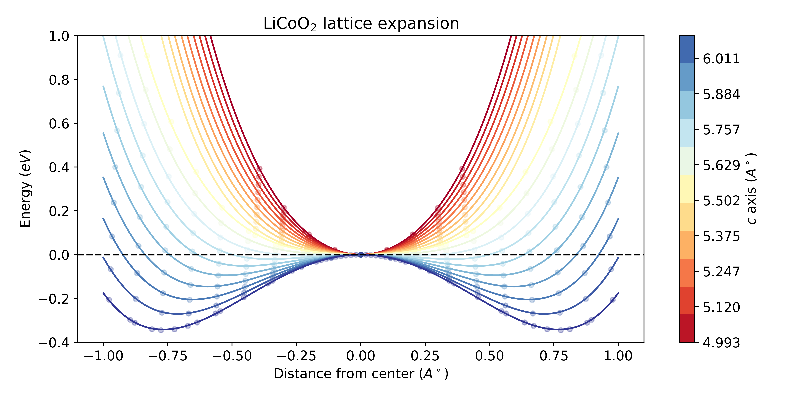

# (Li/Na)xCoO2

DFT + theory for the mechanism of superconductivity in hydrated sodium cobaltate
(NaxCoO2·yH2O). *Link to the paper to be added.*

## Layout

| Folder | Contents |
|---|---|
| `paper/` | **The current manuscript**: `main.tex` (letter), `supplement.tex` (SM), `refs.bib`, built `main.pdf` / `supplement.pdf` / `main_with_sm.pdf` |
| `paper/figures/` | Rendered figure artefacts consumed by the manuscript (PDF + PNG) |
| `paper/figure_scripts/` | Figure sources (`figN.py`, TikZ `.tex`, shared `_style.py`) — see its README |
| `paper/style/` | Writing-style notes and reference sources |
| `paper/archive/` | **Old material**: the superseded full-length article, superseded figures and their generators, AI mock-up candidates |
| `runpod/` | Quantum ESPRESSO production runs and raw results (v1–v4, bands, ensemble, z-scan) |
| `theory/` | Effective model: well fits, quantized levels, coupling, Tc; `results/` CSVs feed the figures |
| `reanalysis/` | Recent re-analysis passes |
| `spin_analysis/` | Magnetization / Stoner analysis |
| `phase_transition/` | Original (Li/Na)CoO2 phase-transition study (Questaal/GPAW era) |
| `QE/` | Quantum ESPRESSO input generation notebooks |
| `structures/` | CIF structure files |
| `legacy/` | Early standalone scripts, notebook, and charge-density cubes from the original study |

  

